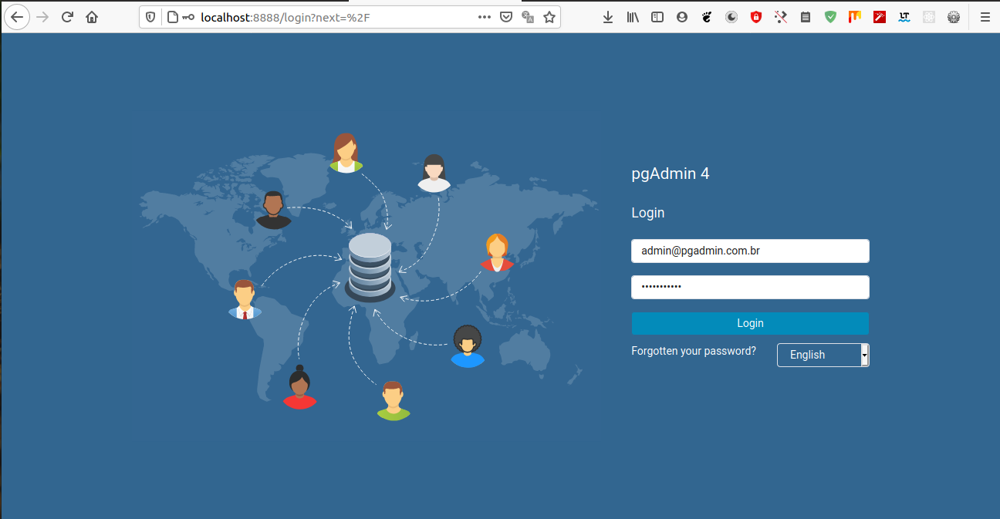
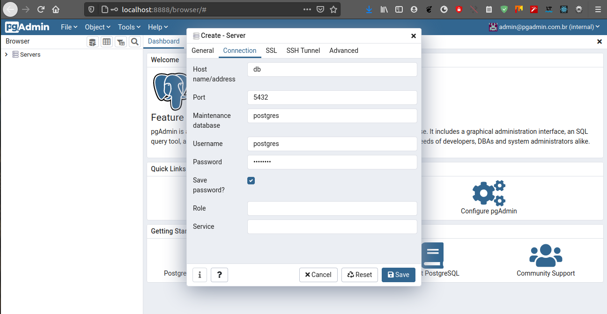

# Ambiente de estudos PostgreSQL com docker

## Sobre o repositório

Esse repositório foi criado com o intuito de estudar o banco de dados relacional PostgreSQL. A primeira parte mostra como executar o projeto usando docker e a segunda parte um resumo de scripts e dicas sobre o PostgreSQL. Montei aqui um ambiente com dois serviços, O serviço db que roda uma instância do banco de dados  e outra instância onde roda o serviço pgadmin para manipular o banco.

## Como executar o ambiente

Um pré-requisito para executar o ambiente é ter o docker e docker-compose instalados.
As instruções de instalação do docker estão na documentação que pode ser acessada no seguinte [link](https://docs.docker.com/engine/install/).

### Execute o arquivo compose

Atendendo aos pré-requisitos e tendo clonado o repositório vamos primeiramente executar o seguinte comando na raiz do projeto.

``` bash
docker-compose up -d
```

### Faça o login

Após os dois serviços subirem vamos abrir o browser e digitar a seguinte url:

[http://localhost:8888](http://localhost:8888)

A porta "8888" é a porta que foi definida no arquivo docker-compose.yml para o serviço pgadmin rodar.

Após alguns segundos será exibida a seguinte tela:



Para logar basta usar o email e password definidos no environment do serviço, que são mostrados abaixo:

Email: admin@pgadmin.com.br

Senha: pgadmin2020

Após o login será exibido o painel principal, como mostra a imagem abaixo.


### Configure uma conexão entre o postgresql e o pgadmin

Para criar a conexão vamos clicar na opção Add New Server  e vamos inserir os dados definidos no arquivo docker-compose.yml. São eles:

* **Name** - Primeiramente vamos definir um nome qualquer para a conexão na aba "General". Eu usei o nome "docker".

* **Host name/address** - Agora na aba Connection vamos usar a url do serviço que no nosso caso é o nome do container definido, "db".

* **Port** - A porta é a padrão do postgresql, a porta "5432".

* **Username** - O username é o padrão "postgres".

* **Password** - O password é o que definimos no arquivo, "postgres".



Após salvar as configuração deverá ser exibido um dashboard como mostra a imagem abaixo e o ambiente de estudos já está pronto.


## Sobre o PostgreSQL

PostgreSQL é um poderoso sistema de banco de dados relacional de objeto de código aberto que usa e estende a linguagem SQL combinada com muitos recursos que armazenam e escalam com segurança as cargas de trabalho de dados mais complicadas.

O PostgreSQL ganhou uma forte reputação por sua arquitetura comprovada, confiabilidade, integridade de dados, conjunto de recursos robustos, extensibilidade e dedicação da comunidade de código aberto por trás do software para fornecer soluções inovadoras e de alto desempenho de maneira consistente.

Para maiores informações consultar a [documentação oficial](https://www.postgresql.org/docs/).

Os comandos executados abaixo foram executados através do console do [pgAdmin4](https://www.pgadmin.org/) por ter uma quantidade maior de recursos e ser mais intuitivo de trabalhar.

### Verificar se o banco está ativo

``` sql
SELECT NOW();
```

### Criar um novo database

``` sql
CREATE DATABASE database_name;
```

### Listar os databases criados

``` sql
 \l
```

### Apagar database

``` sql
DROP DATABASE database_name;
```

### Criar uma tabela

O exemplo abaixo cria uma tabela aluno com vários atributos:

``` sql
CREATE TABLE aluno (
   id SERIAL,
   nome VARCHAR(255),
   cpf CHAR(11),
   observacao TEXT,
   idade INTEGER,
   dinheiro NUMERIC(10,2),
   altura real,
   ativo BOOLEAN,
   data_nascimento DATE,
   hora_aula TIME,
   matriculado_em timestamp
);
```

Tipos mais usados:

* SERIAL - se incrementa automaticamente; 
* VARCHAR(255) - possue um range de 0 até 255 caracteres; 
* CHAR(11) - define um tamanho exato para o atributo; 
* TEXT - simula o valor do tipo TEXT com um texto gigantesco e não sabemos o limite dele; 
* INTEGER - um número inteiro, sem casas decimais; 
* NUMERIC(10, 2) - representa dez caracteres e duas casas decimais; 
* real - número com casa decimais; 
* BOOLEAN - diz se está ativo ou não, atribuindo true ou false; 
* DATE - define a data de nascimento ou algo do tipo; 
* TIME - simula um horário de acesso para um usuário; 
* timestamp - hora consiste na concatenação de uma data e hora, seguida por um fuso horário opcional.

### Listando e filtrando itens de uma tabela

O "*" trás todos os campos da tabela aluno.

``` sql
SELECT * FROM aluno;
```

Para filtrar os dados por campo podemos fazer como no exemplo abaixo. O campo escolhido foi o "nome".

``` sql
SELECT nome FROM aluno;
```

Para trazer mais dados basta ir adicionando o campo seguido de vírgula. Como no exemplo abaixo, onde são exibidas as colunas de "nome" e "altura".

``` sql
SELECT nome, altura	FROM aluno;
```

Podemos também alterar o título a ser exibido ao filtrar um item. Abaixo segue um exemplo onde é exibido o título "quando_se_matriculou" ao invés de "matriculado_em".

``` sql
SELECT nome,
	altura,
	matriculado_em AS quando_se_matriculou
	FROM aluno;
```

Para texto com espaços basta colocar os mesmos entre aspas. Segue exemple abaixo, onde o campo "nome" passou a ser substituido por "Nome do Aluno" na exibição do título do campo.

``` sql
SELECT nome AS "Nome do Aluno",
	altura,
	matriculado_em AS quando_se_matriculou
	FROM aluno;
```

### Inserir dados na tabela criada

Veja o uso do comando ` INSERT ` na [documentação oficial](https://www.postgresql.org/docs/12/sql-insert.html).

O comando INSERT - cria novas linhas em uma tabela
Abaixo segue um exemplo de inserção onde são passados os campos e seus respectivos valores a serem inseridos.

``` sql
INSERT INTO aluno (
	nome,
	cpf,
	observacao,
	idade,
	dinheiro,
	altura,
	ativo,
	data_nascimento,
	hora_aula,
	matriculado_em

) VALUES (
	'Calopsita',
	'11111111101',
	'Aenean ac metus et augue blandit vehicula. Phasellus erat nulla, maximus ac turpis sit amet, lobortis viverra est.',
	35,
	100.50,
	1.81,
	TRUE,
	'1985-12-04',
	'18:30:00',
	'2020-09-28 10:59:28'
)
```

### Atualizar valores na tabela criada

Veja o uso do comando `UPDATE` na [documentação oficial](https://www.postgresql.org/docs/12/sql-update.html).

O WHERE serve para fazer um filtro de quais registros nos desejamos alterar.
Abaixo segue exemplo de update dos dados de um usuário.

``` sql
UPDATE aluno
	SET nome = 'Calopsita',
	cpf = 10987654321,
	observacao = 'Teste',
	idade = 26,
	dinheiro = 15.23,
	altura = 1.90,
	ativo = FALSE,
	data_nascimento = '1994-03-08',
	hora_aula = '13:00:00',
	matriculado_em = '2020-01-02 17:30:45'
WHERE id = 1;
```

### Deletar valores na tabela criada

Veja o uso do comando ` DELETE ` na [documentação oficial](https://www.postgresql.org/docs/12/sql-delete.html).

Uma dica é sempre fazer um filtro antes para saber se o select está correto. Como no exemplo abaixo. Faremos o select na tabela aluno filtrando por Calopsita para ver se os dados existem e vamos alterar os dados corretos.

``` sql
SELECT *
	FROM aluno
   WHERE nome = 'Calopsita';
```

Após confirmarmos que estamos no registro correto vamos deletar agora. Segue um exemplo de como fazer o DELETE abaixo.

``` sql
DELETE
	FROM aluno
   WHERE nome = 'Calopsita';
```

### Filtrar registros de campos do tipo texto

Vamos ver mais algumas formas de filtrar. E para isso primeiramente vamos inserir vários nomes com os outros campos vazios.

``` sql
INSERT INTO aluno (nome) VALUES ('Bob James');
INSERT INTO aluno (nome) VALUES ('Dave Grohl');
INSERT INTO aluno (nome) VALUES ('Joss Stone');
INSERT INTO aluno (nome) VALUES ('Diana Krall');
INSERT INTO aluno (nome) VALUES ('Andre Nieri');
```

Como já sabemos o filtro é baseado no comando ` `  ` WHERE `  ` ` . Então primeiramente vamos pesquisar exatamente um texto usando o símbolo "=".

``` sql
SELECT * 
	FROM aluno
    WHERE nome = 'Calopsita';
```

Para pesquisar todos os nomes diferentes de Calopsita usamos os sinais de "<>", ou podemos usar também os sinais de "!=" mas comumente vistos nas várias linguagens de programação. Os dois scripts abaixo trazem o mesmo retorno.

``` sql
SELECT * 
	FROM aluno
    WHERE nome <> 'Calopsita';
```

``` sql
SELECT * 
	FROM aluno
    WHERE nome != 'Calopsita';
```

O uso do operador `LIKE` .
Suponde que tenhamos dois Registros parecidos em uma tabela. Um de nome Diego e outro de nome Diogo.
Podemos usar o "_" para ignorar os caracteres diferentes do nome, e os nomes que tenham caracteres em comum serão listados.

``` sql
SELECT * 
	FROM aluno
    WHERE nome LIKE 'Di_go';
```

O operador NOT LIKE funciona de forma oposta ao like. E trás o que é diferente a condição. Entenda melhor no exemplo abaixo, onde serão listados todos os nomes exceto Diego e Diogo.

``` sql
SELECT * 
	FROM aluno
    WHERE nome NOT LIKE 'Di_go';
```

Podemos usar o operador ` LIKE ` com o símbolo de "%" também.
O exemplo abaixo lista todos os nomes que começarem com a letra "D" maiúscula. 

``` sql
SELECT * 
	FROM aluno
    WHERE nome LIKE 'D%';
```

Já o seguinte exemplo lista todos os nomes que terminal com a letra "a" minúscula.

``` sql
SELECT * 
	FROM aluno
    WHERE nome LIKE '%a';
```

Listando nomes que contenham espaço.

``` sql
SELECT * 
	FROM aluno
    WHERE nome LIKE '% %';
```

Listando nomes que contenham um determinado caracter no primeiro nome e outro caracter no segundo nome.
Vamos supor que temos uma tabela com os nomes Bob James, Dave Grohl, Joss Stone, Diana Krall, Andre Nieri. No exemplo abaixo seria listado o nome "Diana Krall", que contém a letra "i" na primeira palavra e "l" na segunda palavra.

``` sql
SELECT * 
	FROM aluno
    WHERE nome LIKE '%i%l%';
```
